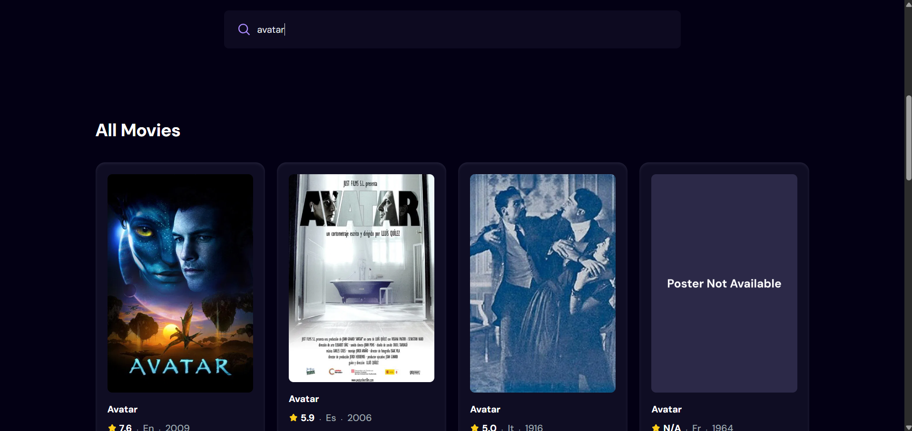
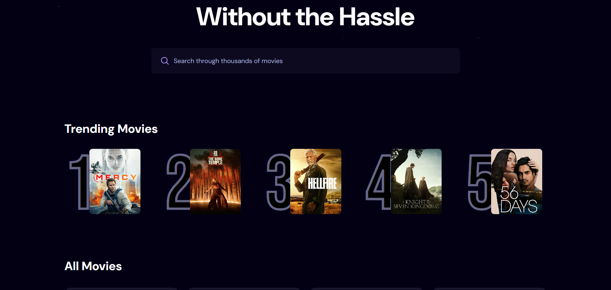

#🎬 Movie Canvas  

[](https://moviecanvas.netlify.app/)

- A modern movie discovery application built with React + Vite that allows users to:

🔍 Search movies with debounced input

📈 View trending movies

⭐ See ratings, language, and release year

⚡ Experience fast performance with Vite

🚀 Live Features

- Search movies using TMDB API

- Debounced search to reduce unnecessary API calls

- Trending movies section

- Responsive UI with Tailwind CSS

- Loading states & error handling

- Clean reusable components

🛠 Tech Stack

- React 19

- Vite 7

- Tailwind CSS 4

- TMDB API

react-use (for debouncing)
```
📂 Project Structure
movie_app/
│
├── public/
│   ├── hero.png
│   ├── search.svg
│   ├── star.svg
│   └── no-movie.png
│
├── src/
│   ├── components/
│   │   ├── MovieCard.jsx
│   │   ├── Search.jsx
│   │   └── Spinner.jsx
│   │
│   ├── App.jsx
│   ├── index.css
│   └── main.jsx
│
├── .env
├── package.json
└── vite.config.js
```

🔑 Environment Variables

This project uses TMDB API.

Create a .env file in the root folder:

VITE_TMDB_API_KEY=your_tmdb_bearer_token_here


⚠️ Important:

Use your TMDB Bearer Token

Do not expose your API key publicly

📦 Installation

Clone the repository:

git clone https://github.com/1sanjeetsharma/movie_app.git
cd movie_app


Install dependencies:

npm install


Run development server:

npm run dev


Build for production:

npm run build


Preview production build:

npm run preview

🧠 How Debouncing Works

The app uses react-use's useDebounce hook to:

Wait 500ms after user stops typing

Trigger API call only after delay

Reduce unnecessary API requests

Improve performance and UX

🎯 Future Improvements

Pagination support

Movie details page

Genre filtering

Dark mode toggle

Watchlist feature

📜 License

This project is open source and available under the MIT License.

👨‍💻 Author

Sanjeet Sharma
GitHub: https://github.com/1sanjeetsharma
## 📸 Screenshots

### 🏠 Home Page


### 🔍 Search Feature


### 📈 Trending Movies

